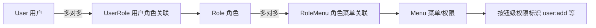

# 角色权限系统(RBAC)任务清单

> 练手项目任务规划。先完成登录鉴权,再按阶段推进角色权限。
> 状态标记:`[ ]` 未开始 / `[~]` 进行中 / `[x]` 已完成

## 一、RBAC 整体模型



核心思想:**用户 → 角色 → 菜单(权限)**,用户不直接绑权限,通过角色间接获得。

## 二、任务阶段

### 阶段 1:登录鉴权模块(当前进行中)

- [X] pom.xml 添加 jjwt 依赖(api / impl / jackson,版本 0.12.x)
- [X] JwtUtil:签发 / 解析 token(HS256,密钥放 application.properties)
- [X] PasswordEncoder 抽成 Bean(SecurityConfig 中定义,UserServiceImpl 改注入)
- [X] UserService 新增独立 register 方法(当前委托 addUser,后续再扩展)
- [X] LoginRequestBody(带校验)、LoginVO(token + UserVO)
- [X] AuthenService.login:查用户 → matches 比对 → 签发 token(失败统一提示,防枚举)
- [X] AuthController:POST /register、POST /login(外部路径 /jiege/auth/xxx)
- [X] JwtAuthenticationFilter:try-catch 已补,依赖 claims 的逻辑已整体挪入 try,篡改 token 返回 401 而非 500(联调验证通过)
- [X] SecurityConfig:STATELESS、csrf 关闭、放行 login/register、自定义 EntryPoint 返回 JSON 401
- [X] WebLogAspect 密码脱敏:方案 B 完成。结论修正:Jackson 3 迁移中注解是唯一例外,@JsonProperty 仍用 com.fasterxml.jackson.annotation 包名(编译已验证 tools.jackson.annotation 包不存在),三个 DTO 保持原包名即生效
- [X] 修复 UserVO 缺 @Getter 导致序列化为空对象的 bug
- [X] 联调验证(2026-08-15):注册 200 → 登录拿 token → 无 token 401 → 带 token 200 → 篡改 token 401(非 500)→ 错误密码/不存在用户统一 code=10005,全部通过
- [x] 遗留修复①:UserDao.xml getUserListByCursor 游标方向已正确(`#{lastId} > id`,等价 id < lastId,取更旧记录)
- [x] 遗留修复②:UserController.listUsers 已改 query 参数(page/size/lastId 三个 @RequestParam,参照 RoleController.listRoles),联调验证:GET /user?page=1 不带 body 返回 200(修复前 400)、无 token 401、page2 缺 lastId 返回 40000、游标翻页正常。连带修复:UserVO/RoleVO 补充自增 id 字段(游标分页客户端需拿上一页最后一条的 id,原 VO 不暴露导致翻页无法闭环)

### 阶段 2:角色模块(Role)(已完成)

- [X] 建表 sys_role(role_id / role_name / role_key / description / status / 时间戳)+ 提前建 sys_user_role(支撑删除前校验)
- [X] Role 实体、RoleDao(RoleDao.xml)、RoleService、RoleController
- [X] 接口:POST /role、PUT /role、DELETE /role/{roleId}(绑定用户时禁止,code=10105)、GET /role/{roleId}、GET /role/list(分页参数走 query string)、PUT /role/{roleId}/status
- [X] 状态启用/禁用(0-禁用 1-启用,RoleStatus 枚举)
- [X] 联调通过(2026-08-15):新增、roleKey 查重 10102、修改、禁用/启用、列表(游标 DESC 排序正确、page2 无 lastId 返回 40000)、删除、删除后查询 10104

### 阶段 3:菜单权限模块(Menu)(已完成)

- [x] 建表 sys_menu(menu_id / parent_id 树形 / menu_name / path / perms / type / icon / sort / status)+ 提前建 sys_role_menu(支撑删除前校验角色引用)
- [X] 解决重名问题:enums/Menu.java 已改名 MenuType,枚举值已填全 DIRECTORY(1)/MENU(2)/BUTTON(3)
- [x] Menu 实体(含字段注释)、MenuDao(MenuDao.xml)、MenuService、MenuController、MenuCreateRequestBody/MenuUpdateRequestBody、MenuVO(树形含 children)、MenuStatus 枚举
- [x] 接口:POST /menu、PUT /menu、DELETE /menu/{menuId}(有子菜单 10205/被角色引用 10206 禁止)、GET /menu/tree(全部菜单树,含禁用);修改时 parentId 不能指向自己(防循环)
- [x] 联调通过(2026-08-16):新增目录/子菜单/按钮、名称查重 10201、perms 查重 10202、父菜单不存在 10207、树三级结构、修改、parentId=self 10207、有子菜单删除 10205、被角色引用删除 10206(SQL 直插关联验证)、删除后重删 10204,共 19 项全部通过

### 阶段 4:关联与分配

- [x] 建表 sys_user_role(user_id + role_id)、sys_role_menu(role_id + menu_id)——两张关联表已分别于阶段 2/3 提前建
- [ ] 给用户分配角色:PUT /user/{userId}/roles + 回显接口 GET /user/{userId}/roles
- [ ] 给角色分配菜单:PUT /role/{roleId}/menus + 回显接口 GET /role/{roleId}/menus

### 阶段 5:鉴权接入

- [ ] 登录时查询用户角色与权限标识,注入 JWT claim 或 LoginUser
- [ ] 接口:GET /user/menus(当前用户菜单树)、GET /user/perms(权限标识列表)
- [ ] 方法级鉴权:自定义 @RequirePermission 注解 + 切面,或 @PreAuthorize("hasAuthority('xxx')")
- [ ] GlobalExceptionHandler 验证 403 场景(结论:方法级 @PreAuthorize 抛的 AccessDeniedException 能被 @RestControllerAdvice 捕获,届时启用注释中的 handler;URL 级授权则发生在过滤器链,需配 accessDeniedHandler。注释中的 AuthenticationException handler 无效可删,401 已由 SecurityConfig EntryPoint 统一处理)

### 阶段 6:双令牌升级(Access + Refresh)(可选进阶)

- [ ] JwtUtil 签发时加 type claim 区分 access/refresh;新增两套过期时间配置(access 短,如 2 小时;refresh 长,如 7 天)
- [ ] 登录同时签发两个 token,LoginVO 增加 refreshToken 字段
- [ ] 新增 POST /auth/refresh:校验 type=refresh(防拿 access token 冒充)→ 签发新 access token
- [ ] SecurityConfig 放行 /auth/refresh
- [ ] (可选)Refresh Token Rotation:每次刷新轮换 refresh token,旧 token 作废(需 Redis 黑名单或版本号存库,纯无状态做不到)
- [ ] (可选)refresh token 改为 opaque 随机串存库:支持主动撤销,access token 仍用 JWT

## 三、表结构设计

| 表 | 关键字段 | 说明 |
|---|---|---|
| sys_role | role_id, role_name, role_key(唯一), description, status | 角色表 |
| sys_menu | menu_id, parent_id, menu_name, path, perms, type(1目录/2菜单/3按钮), icon, sort, status | 菜单权限树 |
| sys_user_role | user_id, role_id | 用户-角色关联 |
| sys_role_menu | role_id, menu_id | 角色-菜单关联 |

## 四、接口总览(外部路径 = context-path /jiege + controller 路径)

### 角色 `/jiege/role`
| 方法 | 路径 | 说明 |
|---|---|---|
| POST | /role | 新增角色 |
| PUT | /role | 修改角色 |
| DELETE | /role/{roleId} | 删除角色(有用户绑定时禁止) |
| GET | /role/list | 分页查询 |
| PUT | /role/{roleId}/menus | 分配菜单权限 |
| GET | /role/{roleId}/menus | 查询已绑菜单 id(回显) |

### 菜单 `/jiege/menu`
| 方法 | 路径 | 说明 |
|---|---|---|
| POST | /menu | 新增菜单/按钮 |
| PUT | /menu | 修改 |
| DELETE | /menu/{menuId} | 删除(有子菜单/被引用时禁止) |
| GET | /menu/tree | 全部菜单树 |

### 用户扩展 `/jiege/user`
| 方法 | 路径 | 说明 |
|---|---|---|
| PUT | /user/{userId}/roles | 给用户分配角色 |
| GET | /user/{userId}/roles | 查询用户角色(回显) |
| GET | /user/menus | 当前用户菜单树(动态路由) |
| GET | /user/perms | 当前用户权限标识列表 |

### 认证 `/jiege/auth`
| 方法 | 路径 | 说明 |
|---|---|---|
| POST | /login | 登录,返回 token + 用户信息 |
| POST | /register | 注册 |
| POST | /refresh | 刷新 access token(阶段 6) |
| GET | /me | 当前登录用户(待实现) |

## 五、类文件规划

```
entity/     Role、Menu、UserRole、RoleMenu
dao/        RoleDao、MenuDao、UserRoleDao、RoleMenuDao
service/    RoleService、MenuService、AuthenService(已建)
controller/ RoleController、MenuController、AuthController(已建)
dto/        RoleCreateRequestBody、RoleUpdateRequestBody、MenuCreateRequestBody、
            AssignRoleRequestBody(userId+roleIds)、AssignMenuRequestBody(roleId+menuIds)
vo/         RoleVO、MenuVO(树形,含 children)、UserInfoVO(用户+角色+权限)
security/   JwtUtil(已建)、LoginUser(已建)
filter/     JwtAuthenticationFilter(已建)
config/     SecurityConfig(已建)
```
