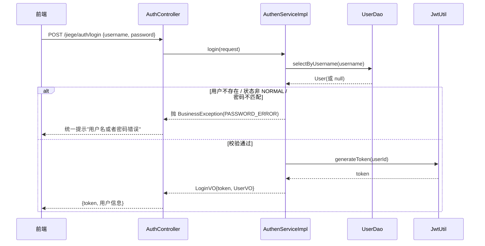
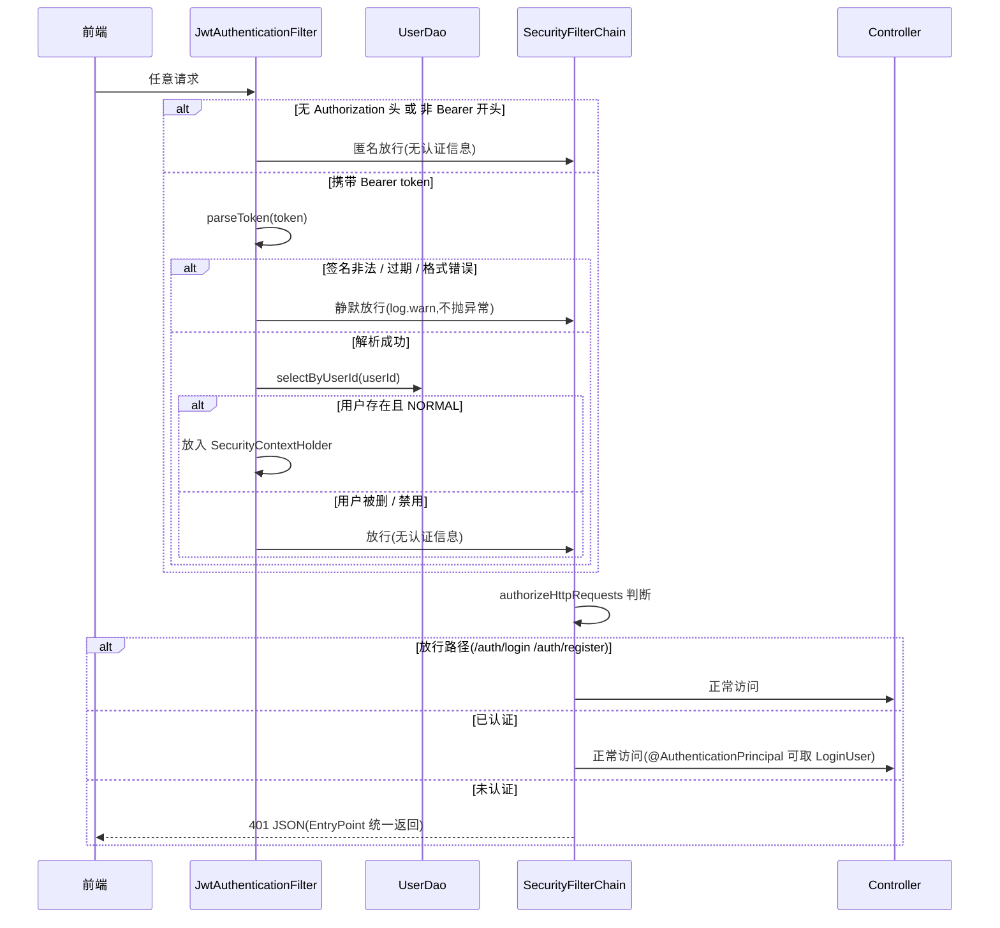

# JWT 登录鉴权模块文档

> 项目:user-author(RBAC 角色权限系统练手项目)
> 技术栈:Spring Boot 4.0.7 / Spring Security 7 / jjwt 0.12.6 / Jackson 3(tools.jackson)/ MyBatis
> 最后更新:2026-08-15

---

## 1. 模块概览

本模块实现基于 JWT 的无状态登录鉴权:

- **登录**:用户名 + 密码校验通过后,签发 JWT token 返回给前端
- **鉴权**:每个请求携带 `Authorization: Bearer <token>` 头,由过滤器解析验证后放入 SecurityContext
- **无状态**:服务端不存 session,`SessionCreationPolicy.STATELESS`,身份信息完全由 token 承载
- **两个对外接口**(外部路径含 context-path `/jiege`):
  - `POST /jiege/auth/login` —— 登录
  - `POST /jiege/auth/register` —— 注册

### 设计原则

1. **过滤器只"识别身份",不"拒绝请求"**
   验证失败时静默放行(不放认证信息),拒绝动作交给 `SecurityConfig` 的 `authorizeHttpRequests` + `AuthenticationEntryPoint` 统一处理,401 响应格式才统一。
2. **两层有效性校验**
   - 密码学有效:`parseToken` 检查签名、过期时间、格式
   - 业务有效:查库验证用户存在且状态为 NORMAL(用户被禁用/删除后,旧 token 立即失效)
3. **防用户名枚举**:登录失败统一提示"用户名或者密码错误",不区分"用户不存在"和"密码错误"

---

## 2. 依赖与配置

### 2.1 Maven 依赖(pom.xml)

```xml
<dependency>
    <groupId>io.jsonwebtoken</groupId>
    <artifactId>jjwt-api</artifactId>
    <version>0.12.6</version>
</dependency>
<!-- impl 和 jackson 只需运行时 -->
<dependency>
    <groupId>io.jsonwebtoken</groupId>
    <artifactId>jjwt-impl</artifactId>
    <version>0.12.6</version>
    <scope>runtime</scope>
</dependency>
<dependency>
    <groupId>io.jsonwebtoken</groupId>
    <artifactId>jjwt-jackson</artifactId>
    <version>0.12.6</version>
    <scope>runtime</scope>
</dependency>
```

### 2.2 配置项(application.properties)

```properties
server.servlet.context-path=/jiege
jwt.secret=f3cb59e9-d541-4e45-9253-1cae096d3a1b
jwt.expire-hours=24
```

- `jwt.secret`:HS256 签名密钥,必须 ≥ 32 字节
- `jwt.expire-hours`:token 过期时间(小时)

---

## 3. 模块组成

| 文件 | 职责 |
| --- | --- |
| `security/JwtUtil.java` | 生成 / 解析 token(封装 jjwt 0.12 API) |
| `security/LoginUser.java` | 认证主体 record(userId + username),放入 SecurityContext |
| `filter/JwtAuthenticationFilter.java` | 每个请求解析 token → 查库 → 放入认证信息 |
| `config/SecurityConfig.java` | 放行规则、无状态、401 处理、挂过滤器、PasswordEncoder Bean |
| `controller/AuthController.java` | `POST /auth/login`、`POST /auth/register` |
| `service/AuthenService.java` / `impl/AuthenServiceImpl.java` | 登录校验 + 签发 token;注册委托给 UserService |
| `dto/LoginRequestBody.java` | 登录入参(username + password) |
| `vo/LoginVO.java` | 登录出参(token + UserVO) |

---

## 4. 核心流程

### 4.1 登录签发流程



登录校验一行合并判断(关键:防止用户名枚举):

```java
if (user == null
        || !user.getStatus().equals(UserStatus.NORMAL.getStatus())
        || !passwordEncoder.matches(request.getPassword(), user.getPassword())) {
    throw new BusinessException(ResponseCode.PASSWORD_ERROR);
}
```

### 4.2 请求鉴权流程



### 4.3 过滤器五步逻辑

```java
// 1. 取 token:没有 Authorization 头或格式不符 → 匿名放行
String authorization = request.getHeader("Authorization");
if (authorization != null && authorization.startsWith("Bearer ")) {
    String token = authorization.substring(7);  // 剥 "Bearer " 前缀(7 字符)
    try {
        // 2. 解析 token:签名非法/过期/格式错误抛 JwtException
        Claims claims = jwtUtil.parseToken(token);
        // 3. 查库验证:禁用/删除立即生效
        String userId = claims.getSubject();  // subject 存的是 userId
        User user = userDao.selectByUserId(userId);
        if (user != null && user.getStatus().equals(UserStatus.NORMAL.getStatus())) {
            // 4. 认证通过:principal 放 LoginUser
            LoginUser loginUser = new LoginUser(userId, user.getUsername());
            UsernamePasswordAuthenticationToken auth =
                    new UsernamePasswordAuthenticationToken(loginUser, null, List.of());
            SecurityContextHolder.getContext().setAuthentication(auth);
        }
    } catch (JwtException | IllegalArgumentException e) {
        log.warn("Invalid JWT token: {}", e.getMessage());
    }
}
// 5. 无论如何都放行:未认证请求由 EntryPoint 统一返回 401
filterChain.doFilter(request, response);
```

---

## 5. 关键 API 备忘(jjwt 0.12)

> ⚠️ 网上老教程(0.9 / 0.11)的 `setSubject()` / `parseClaimsJws()` 已废弃,不要照抄。

**生成 token:**

```java
Jwts.builder()
        .subject(userId)                              // 载荷:subject 存 userId
        .expiration(new Date(System.currentTimeMillis() + expireMillis))
        .issuedAt(new Date())
        .signWith(secretKey)                          // SecretKey = Keys.hmacShaKeyFor(bytes)
        .compact();
```

**解析 token:**

```java
Jwts.parser()
        .verifyWith(secretKey)
        .build()
        .parseSignedClaims(token)
        .getPayload();   // 返回 Claims
```

**解析失败抛出的异常(均为 JwtException 子类):**

| 异常 | 含义 |
| --- | --- |
| `SignatureException` | 签名非法(被篡改) |
| `ExpiredJwtException` | 已过期 |
| `MalformedJwtException` | 格式错误 |

---

## 6. 踩过的坑(经验记录)

1. **过滤器解析必须 try-catch,否则伪造 token 直接 500**
   无效 token 若让 `JwtException` 冒泡,请求会以 500 结束,拿不到 401。

2. **catch 里不能 early return(断链)**
   过滤器里 `return` 会跳过最后的 `filterChain.doFilter()`,请求直接断链,所有接口无响应。正确做法:catch 只 `log.warn`,让流程自然落到放行。

3. **依赖 Claims 的逻辑要整体放进 try**
   曾把 `claims` 声明在 try 外、`claims.getSubject()` 放 try 外,token 无效时 claims 为 null → NPE → 500。修复:取 subject、查库、放认证全部挪进 try。

4. **Jackson 3 注解包名是唯一的例外(Boot 4 大坑)**
   Jackson 3 的运行时类迁到了 `tools.jackson`(如 `tools.jackson.databind.ObjectMapper`、`tools.jackson.core.JacksonException`),但**注解是例外**:`@JsonProperty` 等注解仍发布在 `com.fasterxml.jackson.core:jackson-annotations`(2.x 版本线),包名保持 `com.fasterxml.jackson.annotation`,Jackson 3 databind 向后兼容这些注解。`tools.jackson.annotation` 这个包**不存在**(databind 3.1.4 的 pom 中明确注释 "Annotations remain at Jackson 2.x group id"),改成它会编译失败。所以 DTO 里继续用 `com.fasterxml.jackson.annotation.JsonProperty` 就是正确写法,脱敏正常生效。

5. **登录必须用 POST 而非 GET**
   密码放 URL 会进浏览器历史、访问日志、代理日志。

6. **放行路径不含 context-path**
   SecurityConfig 的 `requestMatchers("/auth/login")` 写的是 controller 路径;外部访问才是 `/jiege/auth/login`。

---

## 7. 联调验收清单

- [ ] `POST /jiege/auth/register` 注册成功,返回 UserVO
- [ ] `POST /jiege/auth/login` 登录成功,返回 token + 用户信息
- [ ] 不带 token 访问受保护接口(如 `/jiege/user`)→ 401 且返回统一 JSON
- [ ] 带合法 token 访问 → 200
- [ ] 篡改 token 任意一个字符 → **401**(不是 500;500 说明过滤器 try-catch 有问题)
- [ ] 删除/禁用用户后,旧 token 访问 → 401(验证业务有效性)
- [ ] 登录接口传错误密码 / 不存在用户 → 返回相同提示(防枚举)

---

## 8. 后续规划(阶段 5 预留)

- `JwtAuthenticationFilter` 第 4 步的 `List.of()` 是权限占位符,做角色权限时在这里查用户的权限列表填入 authorities
- Controller 侧通过 `@AuthenticationPrincipal LoginUser loginUser` 可拿到当前登录用户
